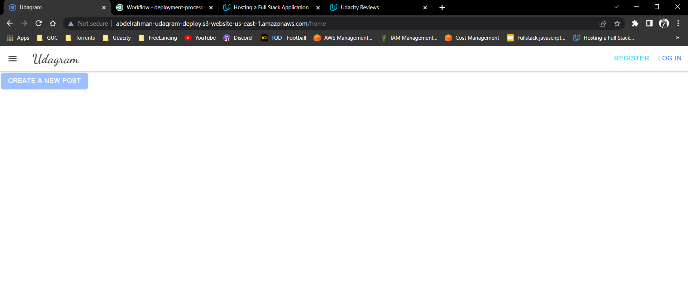

# Hosting a Full-Stack Application

In this project is about hosting a developed Full-Stack application built for a retailer and deploy it to a cloud service provider so that it is available to customers.Using the aws console to start and configure the services the application needs such as a database to store product information and a web server allowing the site to be discovered by potential customers. 

## Built With


 


## Screenshot
website link:http://abdelrahman-udagram-deploy.s3-website-us-east-1.amazonaws.com



## Dependencies

```
- Node v14.15.1 (LTS) or more recent. While older versions can work it is advisable to keep node to latest LTS version

- npm 6.14.8 (LTS) or more recent, Yarn can work but was not tested for this project

- AWS CLI v2, v1 can work but was not tested for this project

- A RDS database running Postgres.

- A S3 bucket for hosting uploaded pictures.

```

### Installation

Provision the necessary AWS services needed for running the application:

1. From the root of the repo, navigate udagram-api folder `cd deployment-process-project/udagram-api` to install the node_modules `npm install`. After installation is done start the api in dev mode with `npm run dev`.
2. Without closing the terminal in step 1, navigate to the udagram-frontend `cd deployment-process-project/udagram-frontend` to intall the node_modules `npm install`. After installation is done start the api in dev mode with `npm run start`.

## Testing

This project contains two different test suite: unit tests and End-To-End tests(e2e). Follow these steps to run the tests.

1. `cd starter/udagram-frontend`
2. `npm run test`
3. `npm run e2e`

There are no Unit test on the back-end

### Unit Tests:

Unit tests are using the Jasmine Framework.

### End to End Tests:

The e2e tests are using Protractor and Jasmine.

### .env file root variables 
```markdown
#Database connection
export POSTGRES_DB=
export POSTGRES_HOST=
export POSTGRES_USERNAME=
export POSTGRES_PASSWORD=
export PORT=
export DB_PORT=
#FrontEnd Connection
export AWS_BUCKET=
export S3BUCKET=
export URL=
#Aws account information
export AWS_REGION=
export AWS_DEFAULT_REGION=
export AWS_PROFILE=
export AWS_ACCESS_KEY_ID=
export AWS_SECRET_ACCESS_KEY=
#JWT Authentication
export JWT_SECRET=
#Elastic beanstalk
export EB_APP=
export EB_ENV=
```